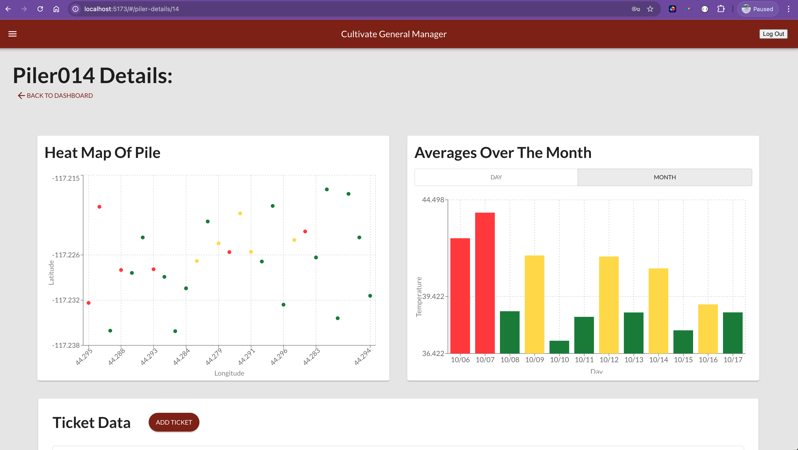
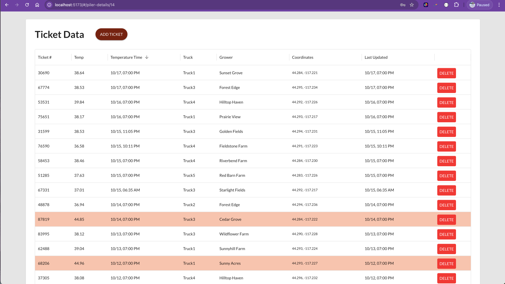
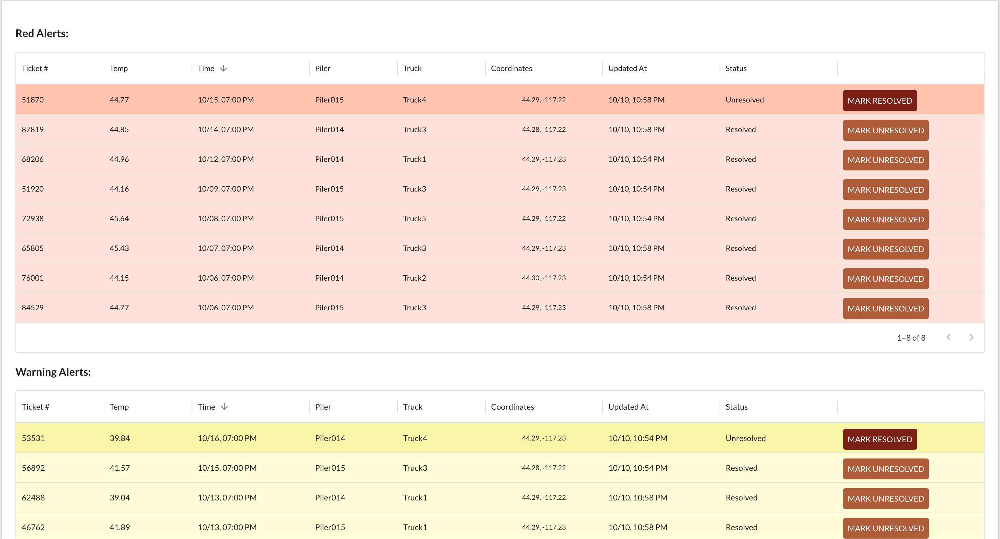
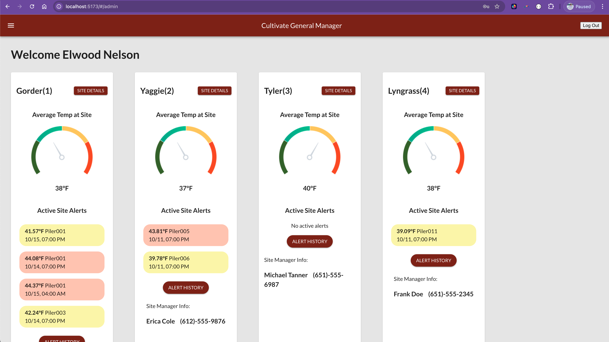
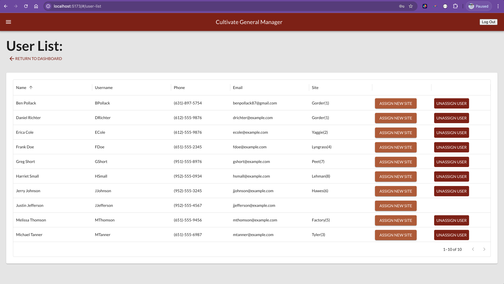

# CULTIVATE

## Description

_Duration: 2 Week Sprint_

Developers:
- [Daniel Richter](https://www.github.com/danielmrichter)
- [Ben Pollack](https://www.github.com/bpol87)
- [Elwood Nelson](https://www.github.com/mntokijabe)

This app is designed to seamlessly integrate with Cultivate Custom Hardware's Beetbox, providing a comprehensive data management solution for beet piling operations. By collecting and aggregating real-time data transmitted from deployed Beetboxes that are attached to beet pilers, the app offers an intuitive interface for on-site personnel. Users can easily visualize critical metrics, such as temperature, GPS location, farmer's info, field locations, and other factors that may impact the quality of stored beets.

With this user-friendly visualization, Site Managers can quickly identify and respond to any readings that threaten produce integrity. Additionally, the app allows General Managers the ability to monitor the overall status of multiple sites and Site Managers, enabling better decision-making and resource allocation. By transforming complex data into actionable insights using comprehensive data visualization, this app empowers teams to maintain optimal conditions and enhance operational efficiency, ultimately safeguarding the quality of their product.

## Screen Shots

Piler Details Page

Piler Details Ticket Table

Alert History Tables

Site View Page

User List

### Prerequisites

Link to software that is required to install the app.

- [Node.js](https://nodejs.org/en/)

## Installation

1. Create a database named `cultivate`,
2. The queries in the `database.sql` file are set up to create all the necessary tables and populate the needed data to allow the application to run correctly. The project is built on [Postgres](https://www.postgresql.org/download/), so you will need to make sure to have that installed. We recommend using Postico to run those queries as that was used to create the queries.
3. Open up your editor of choice and run an `npm install`
4. Create a file called `.env`. This file will provide some environment variables for security. The two that need to be provided are:
    - `DATABASE_URL` - a URL to your database. Should contain login info as query parameters as well.
    - `SERVER_SESSION_SECRET` - A secret to encode passwords and the server session.
4. Run `npm run server` in your terminal
5. Run `npm run client` in your terminal

## Usage
1. User can register as either a Site Manager or a general Manager. Site Managers will see one specific site and need to be assigned to that site by a General Manager. General Managers can see all sites.
2. Each site view has a list of the pilers and an overall site card.
3. Each piler card contains data visualization on the temperatures at the site over the day and can be toggled to see the month view.
4. The site card shows the average temperature at the site in a radial dial and also a temperature reading. It also contains a list of the active alerts for that site. Each alert shows which piler, the high temperature reading, and when the alert came in. 
5. Clicking into the piler card the user is brought to the piler details page. ON the piler details page are a few data visualization charts, one showing a heat map and the other is a larger version of what is on the piler card on the dashboard. It can be toggled from day to month views. 
6. Below the visuals is a table of all tickets that have come in for that specific piler. Warning ticket rows are highlighted in yellow and red-alerts are highlighted in red for quick visual understanding.
7. The site manager can also view the alert history for that site which shows the entire history of the sites warning and red-alerts. Like the piler details table, the rows are color coordinated to each alert status.
8. A General Manager is brought into the Admin dashboard which shows the site cards for each site. These are the same visual as listed above. 
9. Once the General Manager clicks into a site, they see the same dashboard that the site managers can see. 
10. The general manager also has the ability to see all site manager users. They can reassign site managers to different sites or unassign a site manager. Once that site manager logs in they will be taken to the site dashboard of the new site assignment. 

## Built With

- [React.js](https://react.dev/)
- [Node.js](https://nodejs.org/en)
- [Recharts](https://recharts.org/en-US)
- [PostGreSQL](https://www.postgresql.org/)
- [ExpressJS](https://expressjs.com/)
- [Material UI](https://mui.com/material-ui/)
- [TypeScript](https://www.typescriptlang.org/)

## Acknowledgement
- Thanks to Adam Shepard and Cultivate Custom Hardware for giving us this opportunity space.
- Thanks to [Prime Digital Academy](www.primeacademy.io) who equipped and helped us to make this application a reality.
- Thanks to the Pinnacles Cohort for being the best support we could ask for!
